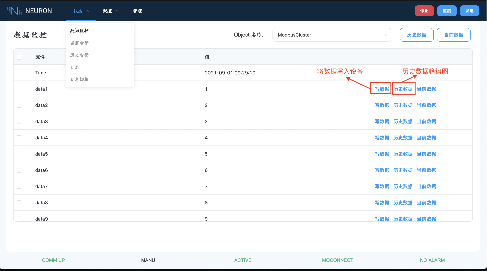
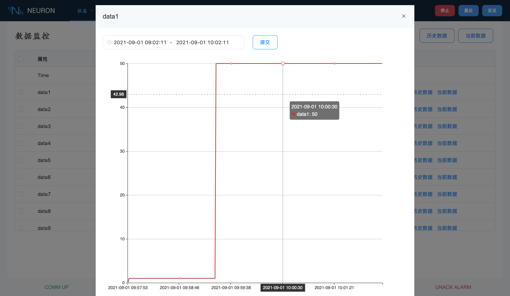
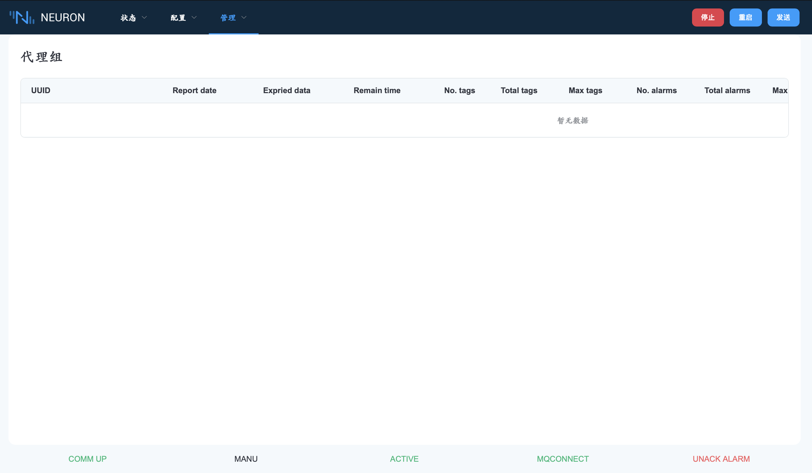

# 状态监测

该功能可以显示数据监控和报警状态。

## 实时数据监测

此页面用于查看和更改所有对象的数据变量，它将显示实时数据和一些可更改的变量。它将显示实时数据和一些可更改的变量。在右边有一个 "写数据" 命令。按下这个按钮并输入数值，可以将数值写入到plc中。

还有每个变量的趋势图。按“历史数据”按钮，它显示了变量的历史趋势。按 "当前" 按钮，则显示该变量的当前趋势。

## 网关列表监测

本页面将列出同一组中的所有 Neuron。它包含当前项目的数据使用情况、过期日期、最大允许对象和属性。

